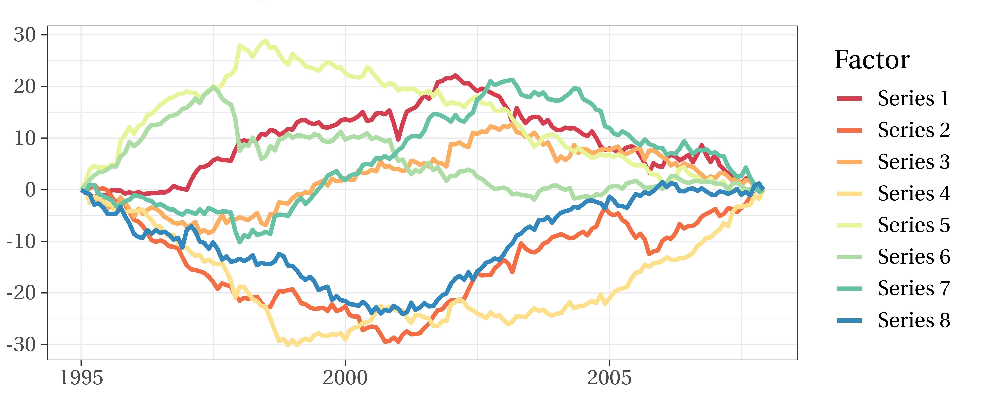
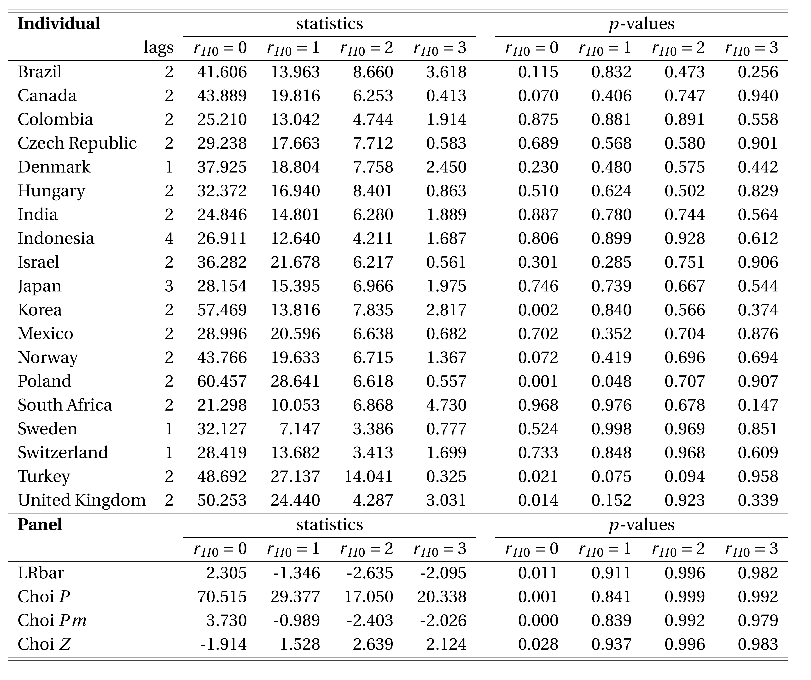
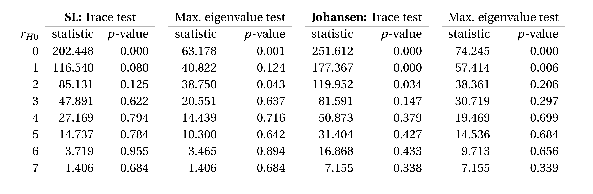

pvars
=====

VAR Modeling for Heterogeneous Panels


## Overview

This package implements (1) panel cointegration rank tests, (2) estimators for panels of VAR, and (3) panel-based identification methods for structural vector autoregressive (SVAR) models. The implemented functions allow to account for cross-sectional dependence in the error terms and for structural breaks in the deterministic terms of the VAR processes.

**(1)** The panel functions to determine the cointegration rank are: 

-   `pcoint.JO()` panel Johansen procedures, 
-   `pcoint.BR()` panel test with pooled two-step estimation, 
-   `pcoint.SL()` panel Saikkonen-Luetkepohl procedures, 
-   `pcoint.CAIN()` correlation-augmented inverse normal test.

**(2)** The panel functions to estimate the VAR models are: 

-   `pvarx.VAR()` mean-group of a panel of VAR models, 
-   `pvarx.VEC()` pooled cointegrating vectors in a panel VECM.

**(3)** The panel functions to retrieve structural impact matrices are: 

-   `pid.chol()` identification of panel SVAR models using Cholesky decomposition to impose recursive causality, 
-   `pid.grt()` identification of panel SVEC models, 
-   `pid.iv()` identification of panel SVAR models by means of proxy variables, 
-   `pid.dc()` independence-based identification of panel SVAR models using distance covariance (DC) statistic, 
-   `pid.cvm()` independence-based identification of panel SVAR models using Cramer-von Mises (CVM) distance.

Supporting tools, such as the specification functions (`speci.VAR`, `speci.factors`) and the panel block bootstrap procedure (`sboot.pmb`), complement the panel VAR functions and complete this coherent approach to ***VAR modeling for heterogeneous panels*** within the **vars** ecosystem. The provided data sets further allow for the exact replication of the implemented literature.


## Installation

Install the most recent development version

``` r
install.packages("devtools")
devtools::install_github("Lenni89/pvars")
```

``` r
library("pvars")
```


## Usage

Several empirical illustrations accompany pvars to demonstrate its application. In the `help()` for functions, the examples provide chunks of R-code for directly copy-pasting unit-tested reproductions. In this README, we show how to reproduce the empirical illustration of Oersal and Arsova (2017, Sec. 5) on the *Monetary Exchange Rate Model*: We first transform the panel data set, then determine the number of factors in the approximate factor model, conduct panel cointegration rank tests on the idiosyncratic components, and finally test the cointegration rank of the common factors.

**Data.** pvars' exemplary data sets are panels in the popular long-format and thus stored as $(N \cdot T ) \times (2 + K )$ `data.frame` objects. The first two columns `id_i` and `id_t` contain factor elements, which serve as identifiers for individuals $i = 1,\ldots,N$ and time periods $t = 1,\ldots,T$. The subsequent $K$ columns contain the $NT$ stacked observations for the $K$ variables. 

``` r
data("MERM")
names_k = colnames(MERM)[-(1:2)]  # variable names
names_i = levels(MERM$id_i)  # country names
head(MERM, n=3)

#    id_i     id_t          s         m          y         p
# 1 Brazil 1995_Jan -0.1660546 -3.094546 0.07401953 0.3357538
# 2 Brazil 1995_Feb -0.1731636 -3.054644 0.07127137 0.3422039
# 3 Brazil 1995_Mar -0.1176580 -3.055017 0.06986985 0.3539417
```

You can use `sapply` to split the long-format panel into a list of $N$ time series matrices. This list is suitable for all panel functions and allows to pick single matrices for individual analysis, too.

``` r
L.data = sapply(names_i, FUN=function(i)
  ts(MERM[MERM$id_i==i, names_k], start=c(1995, 1), frequency=12),
  simplify=FALSE)
```


**Approximate factor model.** To determine the number of common factors in the non-stationary panel, you can select the specification function `speci.factors` of the `speci` module. Among various decision criteria (see `?speci.factors`), the *edge distribution* by Onatski (2010) suggests 8 factors. These are now imposed when estimating the model $y_{it} = \Lambda_i'F_t + y_{it}^{id}$ of PANIC (Bai, Ng 2004) by PCA of the first-differenced, centered, and scaled time series $y_{it}$.

``` r
R.fac1 = speci.factors(L.data, k_max=20, n.iterations=4)
R.fac0 = speci.factors(L.data, k_max=20, n.iterations=4, 
   differenced=TRUE, centered=TRUE, scaled=TRUE, n.factors=8)
```

The same estimated factors $\hat{F}_t$ can be retrieved from `R.fac0` or the subsequent `pcoint` object. Their plot is identical to the original Fig. 4 in Oersal and Arsova (2017, p. 71) up to sign and scale.

``` r
library("ggfortify")
Ft = ts(R.fac0$Ft, start=c(1995, 1), frequency=12)
autoplot(Ft, facets=FALSE, size=1.5) + theme_bw() +
  scale_color_brewer(palette="Spectral") +
  labs(x=NULL, y=NULL, color="Factor", title=NULL)
```




**Panel cointegration tests.** To test the cointegration rank on the panel of idiosyncratic $y_{it}^{id} = y_{it}-\Lambda_i'F_t$, select functions of the `pcoint` module for the related VAR application. The arguments allow to specify the model, i.e. number of common factors `n.factors` and individual `lags` of the 19 countries. For a selected VAR application and specified model, the functions of pvars usually provide all available panel results automatically. In the Latex table generated by `pcoint`'s `toLatex` method, this is visible by *(i)* the averaged test statistic "LRbar" used by Larsson et al. (2001) and Arsova and Oersal (2018) and by *(ii)* the three $p$-value based combinations used by Choi (2001) and Oersal and Arsova (2017).

``` r
R.lags = c(2, 2, 2, 2, 1, 2, 2, 4, 2, 3, 2, 2, 2, 2, 2, 1, 1, 2, 2)
R.pcsl = pcoint.SL(L.data, lags=R.lags, type="SL_trend", n.factors=8)
toLatex(R.pcsl)
```




**Cointegration rank of the factors.** To test the cointegration rank within the common $F_t$, you can perform both (individual) `coint` procedures, Johansen (1996) and Saikkonen, Luetkepohl (2000), here specified with $p_F=2$ lags. The first uses an unrestricted intercept and a linear trend restricted to the cointegration relations ("Case4"), while the second uses the corresponding intercept and linear trend in the additive model ("SL_trend"). As with the panel counterpart `pcoint`, the results of class `coint` are displayed by `toLatex` as a Latex table.

``` r
R.Ftsl = coint.SL(R.pcsl$CSD$Ft, dim_p=2, type_SL="SL_trend")
R.Ftjo = coint.JO(R.pcsl$CSD$Ft, dim_p=2, type="Case4")
toLatex(R.Ftsl, R.Ftjo, write_ME=TRUE,
  add2header=c("\\textbf{SL:} Trace test",
  "\\textbf{Johansen:} Trace test"))
```




## References

-   Arsova, A., and Oersal, D. D. K. (2018): "Likelihood-based Panel Cointegration Test in the Presence of a Linear Time Trend and Cross-Sectional Dependence", *Econometric Reviews*, 37, pp. 1033-1050.
-   Bai, J., and Ng, S. (2004): "A PANIC Attack on Unit Roots and Cointegration", *Econometrica*, 72, pp. 1127-117.
-   Choi, I. (2001): "Unit Root Tests for Panel Data", *Journal of International Money and Finance*, 20, pp. 249-272.
-   Johansen, S. (1996): *Likelihood-based Inference in Cointegrated Vector Autoregressive Models*, Advanced Texts in Econometrics, Oxford University Press, USA.
-   Larsson, R., Lyhagen, J., and Lothgren, M. (2001): "Likelihood-based Cointegration Tests in Heterogeneous Panels", *Econometrics Journal*, 4, pp. 109-142.
-   Oersal, D. D. K., and Arsova, A. (2017): "Meta-Analytic Cointegrating Rank Tests for Dependent Panels", *Econometrics and Statistics*, 2, pp. 61-72.
-   Onatski, A. (2010): "Determining the Number of Factors from Empirical Distribution of Eigenvalues", *Review of Econometrics and Statistics*, 92, pp. 1004-1016.
-   Saikkonen, P., and Luetkepohl, H. (2000): "Trend Adjustment Prior to Testing for the Cointegrating Rank of a Vector Autoregressive Process", *Journal of Time Series Analysis*, 21, pp. 435-456.

